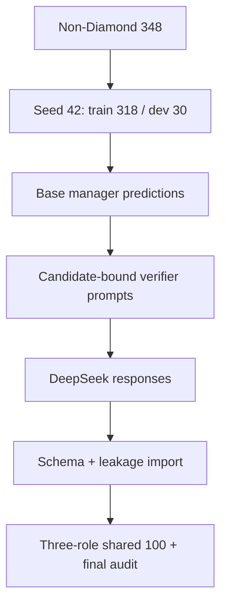

# GPQA verifier DeepSeek 数据流程

这个目录对应主实验 `adc_gpqa_nondiamond_ds`：只使用 GPQA Extended 中排除全部
Diamond 问题后的 348 条缓存，并最终在 198 条 Diamond 问题上评估。

当前仓库保存了 200 条 Extractor 和 200 条 Reasoner 原始 prompt。Verifier prompt
不能脱离 base manager prediction 独立生成，因此在获得真实预测前不应提交一个
`candidate_answer` 为空的占位文件。

## 数据流与不变量



主实验必须同时满足：

- Diamond 与所有训练阶段的 question-hash overlap 为 0。
- Base predictions 和 verifier prompts 使用同一份缓存、split、seed 与采样顺序。
- 至少 95% 的采样题有可解析 manager prediction；每条实际导出的 verifier prompt
  都必须带有效 `candidate_answer`。
- Candidate 只能来自 GT-blind base manager。不能使用 `ground_truth` 或随机选项填充。
- 顶层 `ground_truth` 只供 import 后的审计使用；DeepSeek bridge 只发送 `prompt`。
- 三个 role 最终通过 `question_hash` 选出相同的 100 道题。

## Artifact 说明

| 文件 | 产生阶段 | 是否可提交 |
|---|---|---|
| `extractor_prompts_raw.jsonl` | Extractor prompt export | 已生成 |
| `reasoner_prompts_raw.jsonl` | Reasoner prompt export | 已生成 |
| `base_predictions.jsonl` | Base manager calibration | 由运行环境生成 |
| `verifier_prompts_raw.jsonl` | Candidate-bound verifier export | 通过审计后生成 |
| `*_responses_raw.jsonl` | DeepSeek batch generation | 由运行环境生成 |
| `*_sft_filtered_raw.jsonl` | Schema/leakage import | 由运行环境生成 |
| `*_sft_final.jsonl` | Shared-row selection | 最终 SFT 输入 |

## 0. 环境与固定参数

从 `agent_routing/` 目录执行：

```bash
export BASE_MODEL="<BASE_MODEL_PATH_OR_HF_ID>"
export ID=adc_gpqa_nondiamond_ds
export SEED=42
export TRAIN=outputs/data/gpqa_nondiamond_train348.jsonl
export TEST=outputs/data/gpqa_diamond_eval198.jsonl
export DESC="You are a manager agent solving expert-level graduate science multiple-choice questions."
export TRAIN_ARGS="--gpqa_normalized_cache $TRAIN --train_size 318 --dev_size 30 --test_size 0 --seed $SEED"

export DEEPSEEK_BASE_URL="<OPENAI_COMPATIBLE_BASE_URL>"
export DEEPSEEK_MODEL="<DEEPSEEK_MODEL_ID>"
```

三个尖括号占位符必须由运行者在本机设置；不要把私有模型路径、endpoint 或 API key
提交到仓库。

如果缓存需要重建：

```bash
python scripts/build_gpqa_splits.py \
  --eval_n 198 --seed "$SEED" --out_dir outputs/data
```

## 1. 生成 GT-blind base predictions

这一步需要加载与后续 manager 实验相同的 base model。它只保留能够解析成 A/B/C/D
的预测，不会在解析失败时回退到 ground truth。

```bash
CUDA_VISIBLE_DEVICES=0 python -m src.pipeline.cli export_base_predictions \
  --base_model "$BASE_MODEL" --teacher_id "$ID" $TRAIN_ARGS \
  --base_prediction_n_samples 200 \
  --base_prediction_out outputs/sft_data/$ID/base_predictions.jsonl \
  --task_description "$DESC"
```

检查命令输出中的 `n_requested` 应为 200，且 `parseable_rate` 至少为 0.95
（即 `n_parseable` 至少为 190）；低于该值时不要继续，应先检查 manager 的首行
`ANSWER_<LABEL>` 输出格式或模型加载配置。

```bash
wc -l outputs/sft_data/$ID/base_predictions.jsonl
```

## 2. 重新导出 candidate-bound verifier prompts

```bash
python -m src.pipeline.cli export_deepseek_jsonl \
  --base_model "$BASE_MODEL" --teacher_id "$ID" $TRAIN_ARGS \
  --agent_kind verifier --n_samples 200 \
  --synth_verifier_candidate_jsonl outputs/sft_data/$ID/base_predictions.jsonl \
  --synth_min_verifier_candidate_coverage 0.95 \
  --deepseek_prompt_jsonl outputs/sft_data/$ID/verifier_prompts_raw.jsonl
```

导出器会执行三项保护：

1. `example_id` 对应的 `question_hash` 必须匹配，防止拿错 split/cache。
2. 200 个采样题中至少 95% 必须有合法 choice prediction。
3. 覆盖率通过后，只写出真正带 candidate 的 verifier prompts；不会写空候选占位行。

因此最终行数可能为 190–200。后续只需要 100 个三 role 共享的合格样本。

## 3. 在调用 DeepSeek 前审计 prompts

```bash
python scripts/audit_deepseek_prompts.py \
  outputs/sft_data/$ID/extractor_prompts_raw.jsonl \
  outputs/sft_data/$ID/reasoner_prompts_raw.jsonl \
  outputs/sft_data/$ID/verifier_prompts_raw.jsonl \
  --min_rows 190 \
  --require_verifier_candidates \
  --min_verifier_candidate_coverage 1.0
```

这里使用 `1.0` 是因为导出器已经丢弃没有有效 candidate 的行。审计还会检查重复
ID/hash、hash 重算、chat role、candidate marker，以及 prompt 中是否出现显式
ground-truth marker。

## 4. DeepSeek 生成 verifier responses

```bash
python scripts/generate_openai_compatible_jsonl.py \
  --input outputs/sft_data/$ID/verifier_prompts_raw.jsonl \
  --output outputs/sft_data/$ID/verifier_responses_raw.jsonl \
  --base_url "$DEEPSEEK_BASE_URL" \
  --model "$DEEPSEEK_MODEL" \
  --workers 4 --temperature 0.4 --max_tokens 3000
```

Bridge 只把每行的 `prompt` 发送给 endpoint。多 worker 返回顺序可能改变，但 import
按 `example_id` 关联，不依赖行顺序。

## 5. 导入并过滤 verifier responses

```bash
python -m src.pipeline.cli import_deepseek_jsonl \
  --base_model "$BASE_MODEL" --teacher_id "$ID" \
  --agent_kind verifier \
  --deepseek_prompt_jsonl outputs/sft_data/$ID/verifier_prompts_raw.jsonl \
  --deepseek_response_jsonl outputs/sft_data/$ID/verifier_responses_raw.jsonl \
  --deepseek_sft_jsonl outputs/sft_data/$ID/verifier_sft_filtered_raw.jsonl \
  --deepseek_teacher_model "$DEEPSEEK_MODEL" \
  --synth_symmetric_leakage
```

Import 会再次拒绝空 candidate 或缺少 `CANDIDATE ANSWER TO AUDIT` marker 的 verifier
prompt，然后执行 JSON schema、choice coverage 和 symmetric leakage 检查。失败原因写入：

```text
outputs/sft_data/adc_gpqa_nondiamond_ds/verifier_deepseek_import_log.jsonl
```

不要在主实验使用 `--deepseek_import_raw_responses`，否则会绕过 schema/leakage 过滤。

## 6. 生成或导入另外两个 role

仓库中的 Extractor/Reasoner raw prompts 已可直接进入 DeepSeek generation。若需要从
缓存完全重现，也可以使用与 verifier 相同的 export 命令，只替换 `--agent_kind` 和
输出文件名；这两个 role 的 `candidate_answer` 为空是正确行为。

对每个 `KIND=extractor reasoner`，运行 generation 和 import：

```bash
for KIND in extractor reasoner; do
  python scripts/generate_openai_compatible_jsonl.py \
    --input outputs/sft_data/$ID/${KIND}_prompts_raw.jsonl \
    --output outputs/sft_data/$ID/${KIND}_responses_raw.jsonl \
    --base_url "$DEEPSEEK_BASE_URL" --model "$DEEPSEEK_MODEL" \
    --workers 4 --temperature 0.4 --max_tokens 3000

  python -m src.pipeline.cli import_deepseek_jsonl \
    --base_model "$BASE_MODEL" --teacher_id "$ID" --agent_kind "$KIND" \
    --deepseek_prompt_jsonl outputs/sft_data/$ID/${KIND}_prompts_raw.jsonl \
    --deepseek_response_jsonl outputs/sft_data/$ID/${KIND}_responses_raw.jsonl \
    --deepseek_sft_jsonl outputs/sft_data/$ID/${KIND}_sft_filtered_raw.jsonl \
    --deepseek_teacher_model "$DEEPSEEK_MODEL" \
    --synth_symmetric_leakage
done
```

## 7. 选出三 role 共享的 100 题并做最终审计

```bash
python scripts/select_shared_synthetic_rows.py \
  --extractor outputs/sft_data/$ID/extractor_sft_filtered_raw.jsonl \
  --reasoner outputs/sft_data/$ID/reasoner_sft_filtered_raw.jsonl \
  --verifier outputs/sft_data/$ID/verifier_sft_filtered_raw.jsonl \
  --output_dir outputs/sft_data/$ID --n 100 --seed "$SEED"

python scripts/audit_synthetic_data.py \
  outputs/sft_data/$ID/extractor_sft_final.jsonl \
  outputs/sft_data/$ID/reasoner_sft_final.jsonl \
  outputs/sft_data/$ID/verifier_sft_final.jsonl \
  --min_rows 100 --require_verifier_candidates
```

只有最终审计通过后，`*_sft_final.jsonl` 才能进入 sub-agent SFT。

## 常见失败

| 症状 | 原因 | 处理 |
|---|---|---|
| `found 0/200` | 没传 base predictions，或 prediction 无法解析 | 重新执行步骤 1 |
| `question_hash mismatch` | predictions 来自不同缓存、seed 或 split | 删除错误 artifact，按同一组变量重跑 |
| verifier prompt 少于 190 行 | base prediction 覆盖率不足 | 修复 manager 输出格式后重跑 predictions |
| `missing_candidate_markers` | 使用了旧的空候选 verifier prompt | 从步骤 2 重新导出 |
| import 后不足 100 个共享 hash | DeepSeek schema/leakage 失败过多 | 查看 import log，修 prompt/生成配置后重试 |

`--synth_allow_empty_verifier_candidates` 和
`--synth_random_verifier_candidates` 只用于明确标注的 ablation/legacy 实验，不能用于
`adc_gpqa_nondiamond_ds` 主结果。
